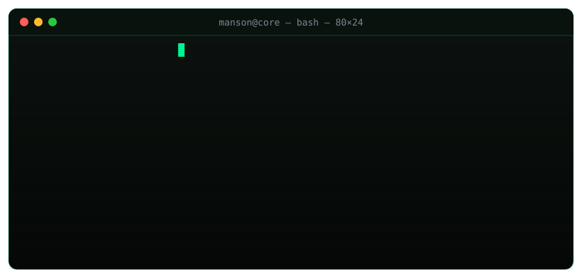

<!-- ╔══════════════════════════════════════════════════════════════════════╗ -->
<!-- ║   MANSONWARE // PROFILE  —  cyber/terminal · animações SVG à mão      ║ -->
<!-- ║   assets/header.svg · assets/terminal.svg · assets/arsenal.svg       ║ -->
<!-- ╚══════════════════════════════════════════════════════════════════════╝ -->

<!-- ░░ HERO — header animado feito à mão (matrix + glitch + scan + HUD) ░░ -->
<div align="center">



</div>

<!-- ░░ LINKS ░░ -->
<div align="center">

<a href="https://mansonware-portfolio.vercel.app" target="_blank">
  
</a>
<a href="https://github.com/Mansonware" target="_blank">
  
</a>


</div>

<!-- ═════════════════════════════════════════════════════════════════════════ -->

## `▸` `[ 01 ]` ./whoami

<div align="center">

<!-- terminal que se digita sozinho — SMIL feito à mão (assets/terminal.svg) -->


</div>

> Estudante de tecnologia construindo uma base sólida em **cibersegurança**, **sistemas Linux**, **redes** e **automação**. Gosto de entender como as coisas funcionam por dentro, aprender na prática e transformar conhecimento em ferramentas.

<table>
  <tr>
    <td align="center" width="50%">🔐 <b>Segurança</b><br/><sub>fundamentos, raciocínio defensivo e mindset ético</sub></td>
    <td align="center" width="50%">🐧 <b>Linux</b><br/><sub>CLI, ambientes Unix-like e internals de sistema</sub></td>
  </tr>
  <tr>
    <td align="center">⚙️ <b>Automação</b><br/><sub>Bash e Python pra matar o repetitivo</sub></td>
    <td align="center">🌐 <b>Redes</b><br/><sub>protocolos, tráfego e como os dados viajam de verdade</sub></td>
  </tr>
</table>

<!-- ═════════════════════════════════════════════════════════════════════════ -->

## `▸` `[ 02 ]` ./arsenal --list

<div align="center">

<!-- barras de proficiência animadas — SMIL feito à mão (assets/arsenal.svg) -->


<br/><br/>


<br/><br/>


</div>

<!-- ═════════════════════════════════════════════════════════════════════════ -->

## `▸` `[ 03 ]` ./telemetry --scan

<div align="center">


<br/>


<br/>


<br/><br/>

<!-- snake "comendo" os commits — gerado pela GitHub Action (.github/workflows/snake.yml) -->
<picture>
  <source media="(prefers-color-scheme: dark)" srcset="https://raw.githubusercontent.com/Mansonware/Mansonware/output/snake-dark.svg" />
  
</picture>

<sub>🐍 a cobra devora os commits do meu grafo de contribuições — atualiza sozinha a cada 12h</sub>

</div>

<!-- ═════════════════════════════════════════════════════════════════════════ -->

## `▸` `[ 04 ]` ./manifesto

<table>
<tr>
<td valign="top" width="50%">

```diff
@@ MODUS OPERANDI @@
+ Entender os sistemas por dentro
+ Aprender criando, testando, quebrando
+ Automatizar tudo que se repete
+ Pensar com lógica e estrutura
+ Evoluir de forma constante
- Aceitar "porque sempre foi assim"
```

</td>
<td valign="top" width="50%">

```diff
@@ TARGETS @@
+ Skills reais em cibersegurança
+ Projetos de automação e segurança
+ Portfólio técnico forte
+ Crescimento profissional em tech
! status: in progress...
```

</td>
</tr>
</table>

<!-- ═════════════════════════════════════════════════════════════════════════ -->

<div align="center">

```ansi
[1;32mvisitor@mansonware:~$[0m [0;37mexit[0m
[0;90mlogout[0m
[1;32m[ connection closed — sempre aprendendo, sempre quebrando ][0m
```


</div>
